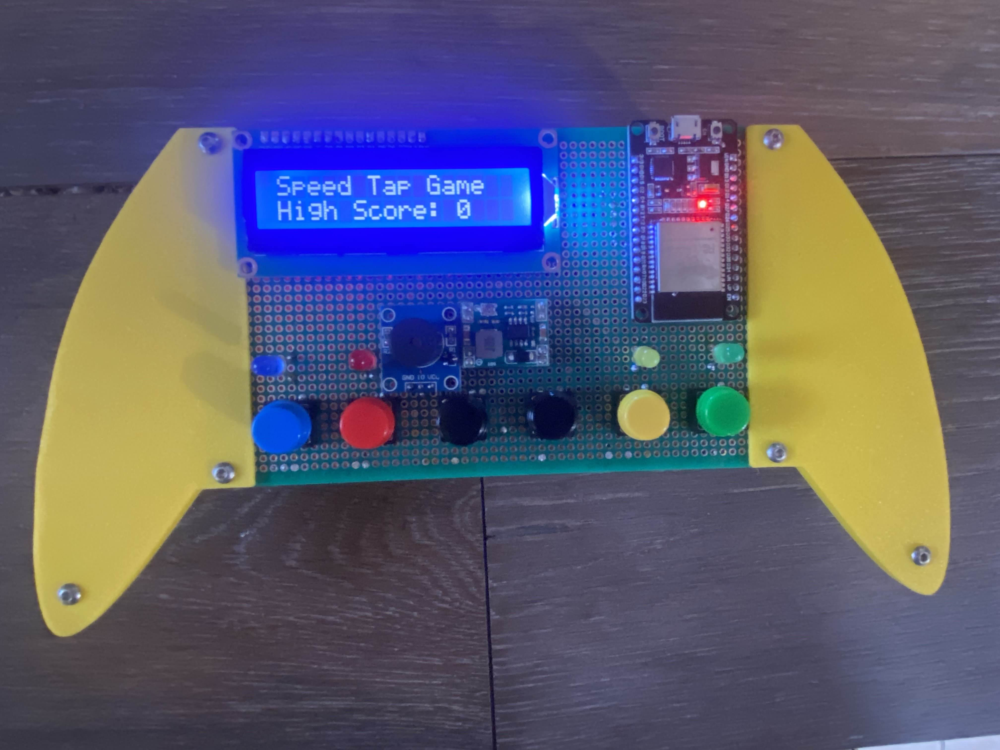

# Speed Tap Game with ESP32 (ESP-IDF + FreeRTOS)

A fun reaction-based Speed Tap Game built on the ESP32 using the ESP-IDF framework and FreeRTOS. This project is designed to test players' reflexes through timed LED signals and button taps.

## Features

- Simple game logic: Tap the button as fast as possible when the LED lights up!
- Reaction time tracking using hardware timers.
- Multitasking using FreeRTOS tasks.
- Score display via LCD Module.
- Built with ESP-IDF and FreeRTOS for precise control and performance.

## Game Model: 

